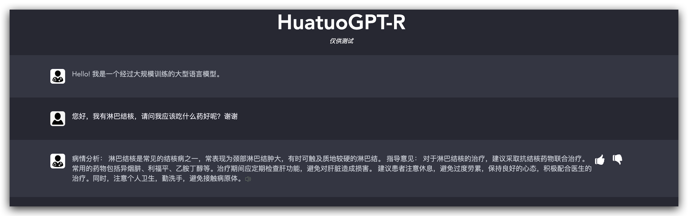

# HuatuoGPT-𝓡: Exploring the reliability of medical LLMs

# 🆁**Introduction**

HuatuoGPT-𝓡 is a retrieval-augmented version of [HuatuoGPT](https://github.com/FreedomIntelligence/HuatuoGPT), designed to provide more effective and safer diagnostic outcomes for patients by referencing a vast collection of real-world physician consultation data. This mitigates the risks posed by potential harmful diagnoses or suggestions arising from language model hallucinations. ‘𝓡’ means reliable, resourceful and reference. In this repository, we provide:

1. **HuatuoGPT-**𝓡 **Retrieval Instruction Dataset**: These instructions are built upon [Huatuo-26M](https://github.com/FreedomIntelligence/Huatuo-26M), the largest-scale chinese medical QA dataset. These instructions enable you to fine-tune your model to use the Huatuo-26M database to deliver more reliable and accurate responses.
2. **HuatuoGPT-**𝓡 **Model**: We release our model and retriever weights to make HuatuoGPT-𝓡 accessible to everyone.
3. **Evaluation Metrics for Effectiveness and Safety**: An evaluation benchmark to evaluate effectiveness and safety of responses from LLMs in medical domain.

# 💭Motivation

- To address the hallucination of large language models and provide a more reliable HuatuoGPT with reference.
- Restrict HuatuoGPT with in a more controllable, traceable, and reliable range.
- A key challenge in employing language models for real-world medical applications lies in guaranteeing safe and effective suggestions or diagnoses, akin to a medical professional. Medical language models can pose safety concerns if they generate diagnoses or prescriptions based on hallucinations or insufficient domain knowledge. Overly focusing on safety could limit the model's ability to offer valuable input in a diagnostic setting. In this repository, we offer more reasonable and comprehensive evaluation methods to better assess the performance of language models in medical consultation scenarios.

# **📚Data**

### Database

- Huatuo-26M:

### Instruction data

- Retrieval Instruction Dataset:

# 🎬 Demo

Demo responses from HuatuoGPT-𝓡,  HuatuoGPT-𝓡 can diagnose patients, prescribe medication  based on their symptoms, and support multi-rounds of conversation.  

# **👨‍⚕️Models**

- HuatuoGPT-R(ChatGLM-backend)
- HuatuoGPT-R(Huatuo-backend)
- Medical Retrieval Model

# Evaluation(Coming soon)